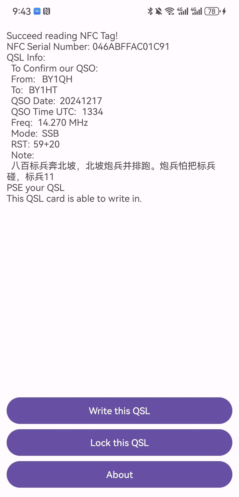

# NFC QSL Android
NFC QSL is an Android application which can use an NFC tag as an **amateur radio QSL info tag**. 
It can read QSL information from NFC tag such as NXP ntag 215, write your own QSL info and set a password to protect your QSL info against tampering.

## How to use it
Firstly get an QSL with NFC tag (or an empty NFC tag such as ntag 215), open NFC QSL and scan that NFC tag. Then QSL information (or "Empty tag" words) will appear on your phone.

Then push "Write this QSL" to fill the blanks of QSO info.

When "Write QSL" button is pushed, QSL info will be written into the NFC tag. Then re-scan the NFC tag, your QSL information will display again.

You can also use "Lock this QSL" to set a password to prevent tampering.

After locking, the QSL info will protected. You can only change QSL info after "Unlocking" the NFC tag.

## Supported NFC tag type
- NXP Ntag 213/215/216

## Data format
### NXP Ntag 213/215/216
Take Ntag 213 as an example, it has totally 180 bytes register, with 144 bytes free for users to edit and other 36 bytes for fixed using, such as serial number, type identification, password and so on. We use these 144 free bytes to store QSL info, such as callsign of both sides, QSO date and time and so on. Detailed info is shown below.

## Further to do
- Information CRC verification
- ADIF input/output
- Other NFC chips supports
